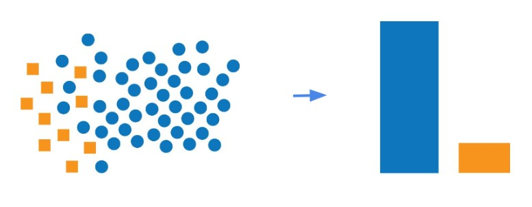
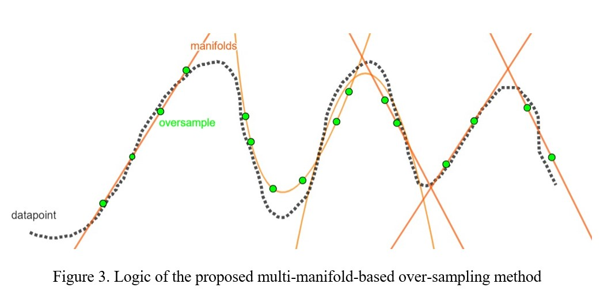
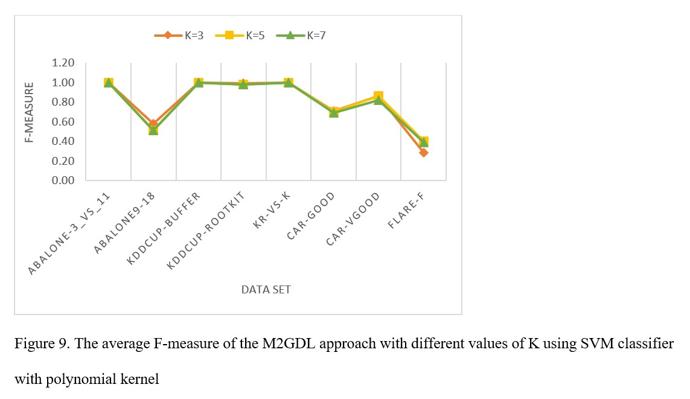

<a href="https://www.sciencedirect.com/science/article/abs/pii/S0020025524011940?dgcid=author" data-popup="right" data-size="large" class="plumx-plum-print-popup" data-site="plum" data-hide-when-empty="true">M2GDL: Multi-manifold guided dictionary learning based oversampling and data validation for highly imbalanced classification problems</a>

# M2GDL-Multi-Manifold-Guided-Dictionary-Learning-based-Over-Sampling

    

## Applications
- imbalanced learning is one of the most difficult categorization challenges in real-world applications. This problem comes when the majority class has more instances than the minority class. Fraud detection, image segmentation, network intrusion detection, disease diagnosis, and other similar challenges are all imbalanced. As a result, the approach developed in this study can be applied to real-world challenges.
- If you are interested in imbalanced learning, you can refine the proposed approach and apply the results to your study or real-world issues.

## Overview
Lack of diversity in synthetic data and inaccurate approximations of the minority class distribution
are two main challenges with most oversampling techniques. This project proposes a multimanifold
guided dictionary learning (M2GDL) approach for minority class oversampling. The
proposed approach checks whether synthetic data points are useful and whether minority-class
samples are important for data generation. The approach utilizes a linear combination of multiple
manifolds by leveraging the inherent substructures of the data. Different data manifolds are
constructed from the minority class training data and evaluated using a novel criterion. The
importance of each sample is calculated within each manifold and then weighted according to the
manifolds’ scores. Samples with the highest scores are identified as significant, and their K nearest
neighbors are used to form a data dictionary for generating artificial data. The proposed sample
generation method is achieved through the iterative solution of an optimization problem. Synthetic
samples are then validated based on their proximity to the minority-class combinatorial
manifold.

## Figures

  
   
 

  
   
 
 

## Dataset
The dataset used in this project is located in the data folder. These data are standard and used in other research.
 
 ## Installation and Setup
- First, install MATLAB 2018 or higher version, then install the dimension reduction toolbox.
- To run the simulation of this research, you must install the Matlab toolbox for dimensionality reduction 
via https://lvdmaaten.github.io/drtoolbox/.
- In this research, the dimension reduction toolbox was used only for unsupervised linear mapping of imbalanced data,
and the dimension reduction operation was not performed on the data.

## How to run the code
- Run the over_sampling_program.m file.
- The descriptions of the codes are placed separately in each file.
- For each specific dataset, you should run the command to load it and after over-sampling,
see the classifier performance criteria.

## Result
- **High performance:** The evaluation results of the approaches based on the average F-Measure show that the proposed multi-manifold approach has a better average  performance compared to other methods.
- **High scalability:** The efficiency of the proposed multi-manifold method is maintained for data with small and large number of samples, small and large number of features, low and large imbalance coefficient.
- **High robustness:** The efficiency of the proposed multi-manifold method is maintained with a very high imbalance coefficient.

  
## Citation
If you use this code in your research or projects, please cite the following paper:

M2GDL: Multi-Manifold Guided Dictionary Learning Based Over Sampling and Data Validation for Highly Imbalanced Classification Problems, 
T Feizi, MH Moattar, H Tabatabaee, Journal of  Information Sciences,  Jul 31, 2024.

[Link to the paper](https://www.sciencedirect.com/science/article/abs/pii/S0020025524011940?dgcid=author)
